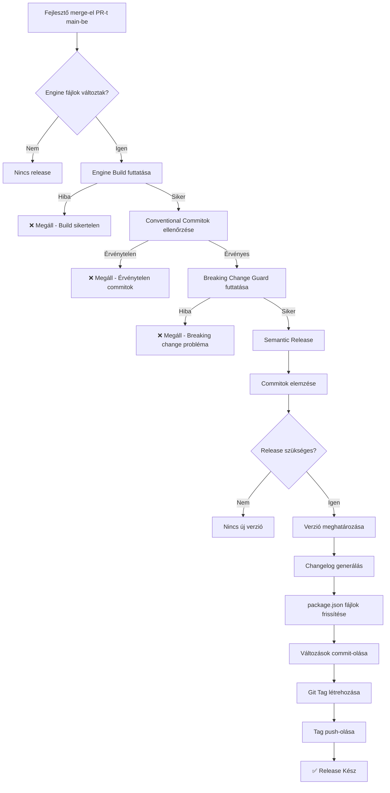

# Engine Release Ellenőrzőlista

> **⚠️ FIGYELEM: Ez a dokumentum csak láthatósági célokat szolgál.**
> 
> A teljes release folyamat **teljesen automatizált**. Emberi beavatkozás **NEM MEGENGEDETT**.
> Ez az ellenőrzőlista azt dokumentálja, amit az automatizálás végez, nem azt, amit neked manuálisan kellene tenned.

---

## Automatizált Release Folyamat

A következők automatikusan megtörténnek, amikor kód bekerül a `main` ágba:

### 1. ✅ Release Előtti Validáció (Automatikus)

- [ ] Minden engine package sikeresen build-el
- [ ] Minden commit követi a Conventional Commits formátumot
- [ ] Breaking change-ek megfelelően jelölve vannak (ha vannak)
- [ ] Kritikus fájl változások megfelelő commit típussal rendelkeznek

**GitHub Actions:**
- `engine-build.yml` - validálja a build-et
- `commitlint.yml` - validálja a commit üzeneteket
- `check-breaking.js` - validálja a breaking change jelzőket

---

### 2. 🔄 Verzió Meghatározás (Automatikus)

A semantic-release elemzi a commitokat és meghatározza a következő verziót:

| Commit Típus | Verzió Növekedés | Példa |
|--------------|------------------|-------|
| `breaking:` | **MAJOR** (1.0.0 → 2.0.0) | Breaking API változások |
| `feat:` | **MINOR** (1.0.0 → 1.1.0) | Új funkciók |
| `fix:` | **PATCH** (1.0.0 → 1.0.1) | Hibajavítások |
| `refactor:` | **PATCH** (1.0.0 → 1.0.1) | Kód refaktorálás |
| `chore:` | **NINCS RELEASE** | Karbantartási feladatok |

**Konfiguráció:** `engine/.releaserc.json`

---

### 3. 📝 Changelog Generálás (Automatikus)

- [ ] Az `engine/CHANGELOG.md` frissül az új verzióval
- [ ] A commitok típus szerint csoportosítva:
  - ⚠️ BREAKING CHANGES
  - ✨ Features
  - 🐛 Bug Fixes
  - ♻️ Code Refactoring

**Plugin:** `@semantic-release/changelog`

---

### 4. 🔄 Verzió Szinkronizáció (Automatikus)

Minden package verzió frissül, hogy egyezzen:

- [ ] `engine/package.json`
- [ ] `engine/packages/config/package.json`
- [ ] `engine/packages/core/package.json`
- [ ] `engine/packages/data-utils/package.json`
- [ ] `engine/packages/themes/package.json`

**Plugin:** `@semantic-release/git`

---

### 5. 📦 Git Commit & Tag (Automatikus)

- [ ] A frissített fájlok commit-olva ezzel az üzenettel:
  ```
  chore(engine): release vX.Y.Z
  ```
- [ ] Git tag létrehozva: `engine-vX.Y.Z`
- [ ] Tag push-olva a repository-ba

**Tag Formátum:** `engine-v${version}`

---

### 6. 🎉 Release Létrehozás (Automatikus)

- [ ] GitHub Release létrehozva
- [ ] A release notes tartalmazza az összes változást
- [ ] A release a megfelelő taggel van megjelölve

**GitHub Actions:** `engine-release.yml`

---

## Mi Indít Release-t?

**Csak ezek az események indítanak automatikus release-t:**

1. Push a `main` ágba
2. Változás észlelhető az `engine/**` útvonalon
3. Érvényes conventional commitok jelen vannak
4. Az engine sikeresen build-el

---

## Mi Akadályoz Meg Egy Release-t?

**A release-ek automatikusan blokkolva vannak, ha:**

- ❌ Az engine build elbukik
- ❌ A commit üzenetek érvénytelenek
- ❌ Breaking change-ek nem rendelkeznek megfelelő jelzőkkel
- ❌ Kritikus fájlok módosítva breaking change deklaráció nélkül

---

## Manuális Beavatkozás

### ⛔ NE TEDD:

- Manuálisan ne szerkeszd a verzió számokat a `package.json`-ban
- Ne hozz létre git tageket manuálisan
- Ne frissítsd a `CHANGELOG.md`-t manuálisan
- Ne futtasd az `npm version` vagy `pnpm version` parancsokat
- Ne force push-olj a `main`-re

### ✅ MEGENGEDETT:

- PR-ek review-zása és merge-elése
- Helyes commit üzenetek írása
- Release workflow logok monitorozása
- Generált changelogok ellenőrzése
- Release tagek verifikálása

---

## Release Verifikáció

Egy automatikus release után ellenőrizd:

1. **Git Tag Létrehozva:**
   ```bash
   git tag -l "engine-v*"
   ```

2. **Changelog Frissítve:**
   ```bash
   cat engine/CHANGELOG.md
   ```

3. **Minden Verzió Egyezik:**
   ```bash
   grep '"version"' engine/package.json engine/packages/*/package.json
   ```

4. **GitHub Release Létezik:**
   - Látogasd meg: https://github.com/[org]/spektra/releases
   - Ellenőrizd a taget: `engine-vX.Y.Z`

---

## Hibaelhárítás

### Nem történt release?

Ellenőrizd a következőket ebben a sorrendben:

1. **Engine Build:**
   - GitHub Actions → `Engine Build Guard`
   - A release előtt át kell mennie

2. **Commit Üzenetek:**
   - GitHub Actions → `Commit Message Enforcement`
   - Minden commitnak követnie kell a konvenciót

3. **Breaking Changes:**
   - Ellenőrizd a `check-breaking.js` logokat
   - Biztosítsd, hogy a kritikus változások jelölve vannak

4. **Release Workflow:**
   - GitHub Actions → `Engine Release Automation`
   - Ellenőrizd a logokat a specifikus hibákért

### A verzió nem az, amit vártál?

Ne feledd:
- A `chore:` commitok **NEM** indítanak release-t
- Csak a `feat:`, `fix:`, `refactor:` és `breaking:` hoznak létre release-t
- A verziót a **commit típusok** határozzák meg, nem a commitok száma

---

## Commit Üzenet Példák

### ✅ ÉRVÉNYES

```bash
# Minor release (új funkció)
feat(core): új téma rendszer hozzáadása

# Patch release (hibajavítás)
fix(data-utils): validációs logika javítása

# Patch release (refaktorálás)
refactor(themes): színpaletta struktúra egyszerűsítése

# Major release (breaking változás)
breaking(core): SiteData szerződés módosítása

# Nincs release (karbantartás)
chore(engine): függőségek frissítése
```

### ❌ ÉRVÉNYTELEN

```bash
# Hiányzó típus
téma rendszer frissítése

# Rossz típus
update(core): új funkció hozzáadása

# Nincs scope/subject elválasztó
feat: téma-frissítés

# Túl általános
fix: dolgok
```

---

## Architektúra Szabályok (KIKÉNYSZERÍTVE)

Ezeket a szabályokat a rendszer kikényszeríti:

1. ✅ Csak az ENGINE verzionált
2. ✅ Minden engine package EGY verziót oszt meg
3. ✅ Szemantikus verzionálás kötelező
4. ✅ A git tagek az igazság forrásai
5. ✅ A release-ek átmenő build-et igényelnek
6. ✅ Conventional commitok szükségesek
7. ✅ A changelogok auto-generáltak
8. ⛔ Manuális verzió módosítások lehetetlenek

---

## Workflow Összefoglaló



---

## Kérdések?

**K: Létrehozhatok release-t manuálisan?**
V: Nem. A rendszer úgy van tervezve, hogy megakadályozza a manuális release-eket.

**K: Hogyan indíthatok MAJOR release-t?**
V: Használd a `breaking:` commit típust vagy adj hozzá `BREAKING CHANGE:` szöveget a commit törzsben.

**K: Ki tudok hagyni egy release-t?**
V: Használd a `chore:` commit típust olyan változásokhoz, amik nem igényelnek release-t.

**K: Mi van, ha változtatnom kell a verzión?**
V: Nem teheted. A verziót a commit history határozza meg.

**K: Hogyan láthatom, milyen verzió lesz release-elve?**
V: Futtasd a semantic-release-t dry-run módban lokálisan (nem ajánlott).

---

**Utoljára Frissítve:** 2026-01-10
**Automatizálás Státusz:** ✅ Teljesen Működőképes
