# Engine Release Checklist

> **⚠️ WARNING: This document is for visibility only.**
> 
> The entire release process is **fully automated**. Human intervention is **NOT ALLOWED**.
> This checklist documents what the automation does, not what you should do manually.

---

## Automated Release Flow

The following happens automatically when code is merged to `main`:

### 1. ✅ Pre-Release Validation (Automatic)

- [ ] All engine packages build successfully
- [ ] All commits follow Conventional Commits format
- [ ] Breaking changes are properly marked (if any)
- [ ] Critical file changes have correct commit type

**GitHub Actions:**
- `engine-build.yml` - validates build
- `commitlint.yml` - validates commit messages
- `check-breaking.js` - validates breaking change markers

---

### 2. 🔄 Version Determination (Automatic)

Semantic-release analyzes commits and determines the next version:

| Commit Type | Version Bump | Example |
|-------------|--------------|---------|
| `breaking:` | **MAJOR** (1.0.0 → 2.0.0) | Breaking API changes |
| `feat:` | **MINOR** (1.0.0 → 1.1.0) | New features |
| `fix:` | **PATCH** (1.0.0 → 1.0.1) | Bug fixes |
| `refactor:` | **PATCH** (1.0.0 → 1.0.1) | Code refactoring |
| `chore:` | **NO RELEASE** | Maintenance tasks |

**Configuration:** `engine/.releaserc.json`

---

### 3. 📝 Changelog Generation (Automatic)

- [ ] `engine/CHANGELOG.md` is updated with new version
- [ ] Commits are grouped by type:
  - ⚠️ BREAKING CHANGES
  - ✨ Features
  - 🐛 Bug Fixes
  - ♻️ Code Refactoring

**Plugin:** `@semantic-release/changelog`

---

### 4. 🔄 Version Synchronization (Automatic)

All package versions are updated to match:

- [ ] `engine/package.json`
- [ ] `engine/packages/config/package.json`
- [ ] `engine/packages/core/package.json`
- [ ] `engine/packages/data-utils/package.json`
- [ ] `engine/packages/themes/package.json`

**Plugin:** `@semantic-release/git`

---

### 5. 📦 Git Commit & Tag (Automatic)

- [ ] Updated files are committed with message:
  ```
  chore(engine): release vX.Y.Z
  ```
- [ ] Git tag is created: `engine-vX.Y.Z`
- [ ] Tag is pushed to repository

**Tag Format:** `engine-v${version}`

---

### 6. 🎉 Release Creation (Automatic)

- [ ] GitHub Release is created
- [ ] Release notes include all changes
- [ ] Release is marked with the correct tag

**GitHub Actions:** `engine-release.yml`

---

## What Triggers a Release?

**Only these events trigger the automated release:**

1. Push to `main` branch
2. Changes detected in `engine/**` path
3. Valid conventional commits present
4. Engine builds successfully

---

## What Prevents a Release?

**Releases are blocked automatically if:**

- ❌ Engine build fails
- ❌ Commit messages are invalid
- ❌ Breaking changes lack proper markers
- ❌ Critical files modified without breaking change declaration

---

## Manual Intervention

### ⛔ DO NOT:

- Manually edit version numbers in `package.json`
- Create git tags manually
- Update `CHANGELOG.md` manually
- Run `npm version` or `pnpm version`
- Force push to `main`

### ✅ ALLOWED:

- Review and merge PRs
- Write proper commit messages
- Monitor release workflow logs
- Check generated changelogs
- Verify release tags

---

## Release Verification

After an automated release, verify:

1. **Git Tag Created:**
   ```bash
   git tag -l "engine-v*"
   ```

2. **Changelog Updated:**
   ```bash
   cat engine/CHANGELOG.md
   ```

3. **All Versions Match:**
   ```bash
   grep '"version"' engine/package.json engine/packages/*/package.json
   ```

4. **GitHub Release Exists:**
   - Visit: https://github.com/[org]/spektra/releases
   - Check for tag: `engine-vX.Y.Z`

---

## Troubleshooting

### Release didn't happen?

Check the following in order:

1. **Engine Build:**
   - GitHub Actions → `Engine Build Guard`
   - Must pass before release

2. **Commit Messages:**
   - GitHub Actions → `Commit Message Enforcement`
   - All commits must follow convention

3. **Breaking Changes:**
   - Check `check-breaking.js` logs
   - Ensure critical changes are marked

4. **Release Workflow:**
   - GitHub Actions → `Engine Release Automation`
   - Check logs for specific errors

### Version not what you expected?

Remember:
- `chore:` commits do **NOT** trigger releases
- Only `feat:`, `fix:`, `refactor:`, and `breaking:` create releases
- Version is determined by **commit types**, not commit count

---

## Commit Message Examples

### ✅ VALID

```bash
# Minor release (new feature)
feat(core): add new theme system

# Patch release (bug fix)
fix(data-utils): correct validation logic

# Patch release (refactor)
refactor(themes): simplify color palette structure

# Major release (breaking change)
breaking(core): change SiteData contract

# No release (maintenance)
chore(engine): update dependencies
```

### ❌ INVALID

```bash
# Missing type
update the theme system

# Wrong type
update(core): add new feature

# No scope/subject separator
feat: update-theme

# Too vague
fix: stuff
```

---

## Architecture Rules (ENFORCED)

These rules are enforced by the system:

1. ✅ Only ENGINE is versioned
2. ✅ All engine packages share ONE version
3. ✅ Semantic versioning is mandatory
4. ✅ Git tags are the source of truth
5. ✅ Releases require passing builds
6. ✅ Conventional commits are required
7. ✅ Changelogs are auto-generated
8. ⛔ Manual version bumps are impossible

---

## Workflow Summary

```mermaid
graph TD
    A[Developer merges PR to main] --> B{Engine files changed?}
    B -->|No| C[No release]
    B -->|Yes| D[Run Engine Build]
    D -->|Fail| E[❌ Stop - Build failed]
    D -->|Pass| F[Check Conventional Commits]
    F -->|Invalid| G[❌ Stop - Invalid commits]
    F -->|Valid| H[Run Breaking Change Guard]
    H -->|Fail| I[❌ Stop - Breaking change issue]
    H -->|Pass| J[Semantic Release]
    J --> K[Analyze Commits]
    K --> L{Release needed?}
    L -->|No| M[No new version]
    L -->|Yes| N[Determine Version]
    N --> O[Generate Changelog]
    O --> P[Update package.json files]
    P --> Q[Commit Changes]
    Q --> R[Create Git Tag]
    R --> S[Push Tag]
    S --> T[✅ Release Complete]
```



---

## Questions?

**Q: Can I create a release manually?**
A: No. The system is designed to prevent manual releases.

**Q: How do I trigger a MAJOR release?**
A: Use commit type `breaking:` or add `BREAKING CHANGE:` in commit body.

**Q: Can I skip a release?**
A: Use commit type `chore:` for changes that don't need a release.

**Q: What if I need to change the version?**
A: You can't. The version is determined by commit history.

**Q: How do I see what version will be released?**
A: Run semantic-release in dry-run mode locally (not recommended).

---

**Last Updated:** 2026-01-10
**Automation Status:** ✅ Fully Operational
